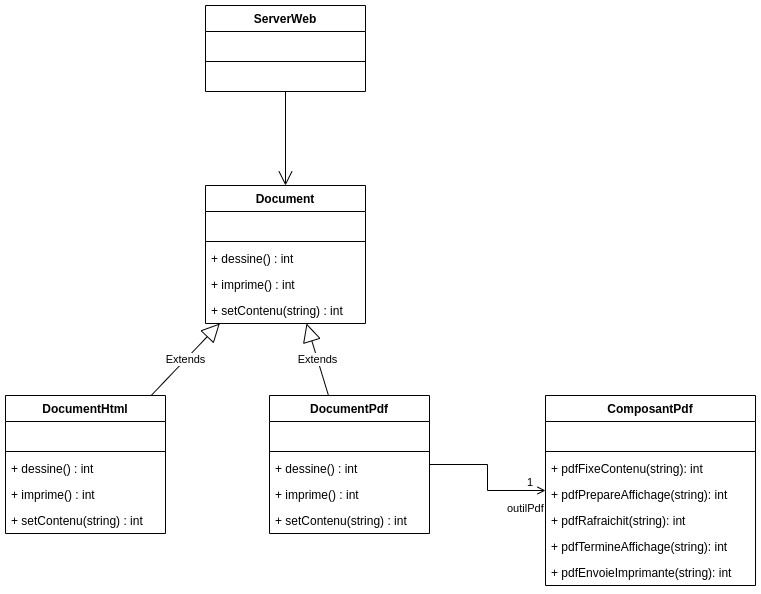

# TP INFO 4067

Nom : **Tomdieu TchadieuKo Ivan Gottfried**

Matricule : **20U2947**

Design Pattern Category : **Structural**

Design Pattern : **Adapter**

## Exercice

On considère un système de vente des véhicules en ligne. Le serveur web de
ce système crée et gère des documents destinés aux clients (facture, bon de
livraison, etc…). Dans un premier temps, l’entreprise ne veut générer que des
documents HTML directement imprimable. Pour ce faire les développeurs de
ce système ont créé lors de l’implémentation du système, une classe
Document qui crée et gère donc les document HTML.
On décide maintenant de générer des documents PDF, et pour cela, les
développeurs ont trouvé un composant logiciel qui le fait et ne voudraient pas
recoder. Proposer une solution pour l’utilisation de ce composant à l’aide du
pattern Adapter.

- **Diagram UML**

    
