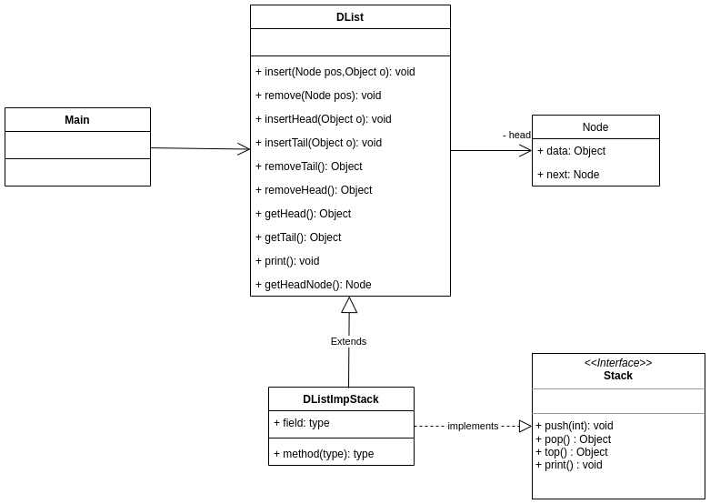

# TP INFO 4067

Nom : **Tomdieu TchadieuKo Ivan Gottfried**

Matricule : **20U2947**

Design Pattern Category : **Structural**

Design Pattern : **Adapter**

## Exercice

On dispose d’une classe DList qui définit une liste doublement chainée et
d’une autre classe (Gestion) qui sait manipuler les piles. On aimerait
utiliser la classe Dlist dans Gestion sans modifier Dlist.

- **Diagram UML**

    