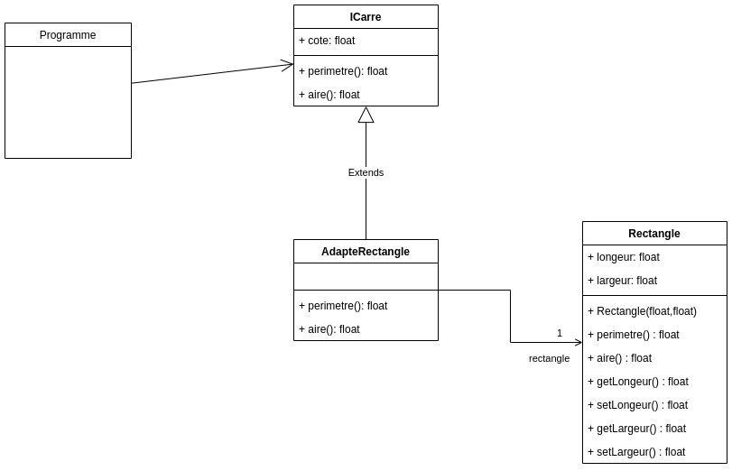

# TP INFO 4067

Nom : **Tomdieu TchadieuKo Ivan Gottfried**

Matricule : **20U2947**

Design Pattern Category : **Structural**

Design Pattern : **Adapter**

## Exercice

On a développé un programme qui sait utiliser une interface qui offre des
services pour gérer les carrés.
Seulement, nous ne disposons qu’une classe qui manipule les rectangles :
définir les paramètres du rectangle, calculer son périmètre et son aire.
On souhaite utiliser cette classe sans changer l’interface que connait notre
programme.

1. Quel est le patron de conception adapté à ce problème
2. Donner sa structure générique et décrire les participants
3. Proposez une solution qui met en œuvre ce patron pour résoudre
problème
4. Donner le code de votre solution

- **Diagram UML**

    
