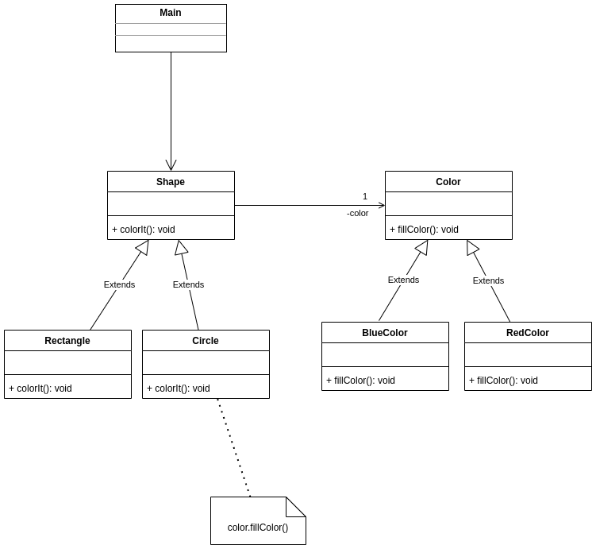

# TP INFO 4067

Nom : **Tomdieu TchadieuKo Ivan Gottfried**

Matricule : **20U2947**

Design Pattern Category : **Structural**

Design Pattern : **Bridge**

## Exercice

On veut gérer des formes géométriques. On a des Rectangles et des
cercles pouvant être de couleur rouge ou bleu.

- **Diagram UML**

    
