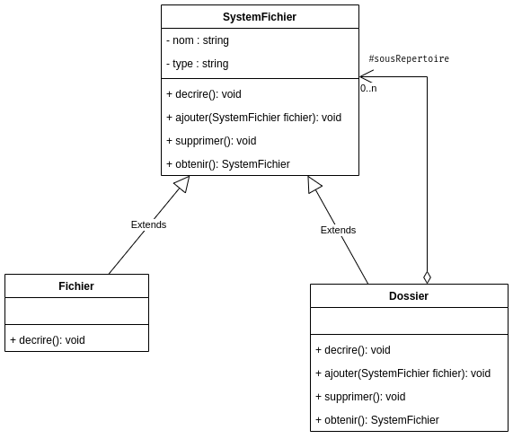

# TP INFO 4067

Nom : **Tomdieu TchadieuKo Ivan Gottfried**

Matricule : **20U2947**

Design Pattern Category : **Structural**

Design Pattern : **Composite**

## Exercice

On considère un système de gestion de fichiers. Ce système gère des
dossiers(répertoires) et chaque répertoire peut contenir des sous répertoires
(pouvant eux aussi contenir des sous répertoires) et des fichiers. Le système ne
connait que 2 types de fichiers : les fichiers TXT et les fichiers PDF.
Chaque élément du système de fichier est caractérisé par :

- Deux attributs : nom et type (txt, pdf, ou dossier)
- Des méthodes :
- decrire : affiche le nom et le type de l’élément. Un dossier affiche en plus, la
description de tous les éléments qu’il contient.
- ajouter un élément à un autre
- supprimer un élément d’un autre
- obtenir le ieme élément d’un autre

- **Diagram UML**

    
