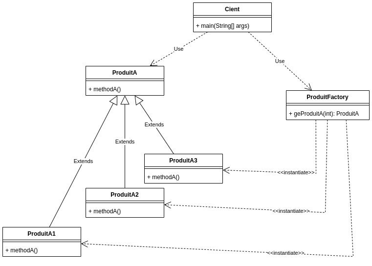

# TP INFO 4067

Nom : **Tomdieu TchadieuKo Ivan Gottfried**

Matricule : **20U2947**

## Exercice

### Factory Pattern : Concrete Factory And Abstract Products

- **Diagram UML**

    

\newpage

## Codes

- ### App.java

    ```java
    import com.factory.ProduitFactory;
    import com.produit.ProduitA;

    public class App {
        public static void main(String[] args) throws Exception {
            ProduitFactory produitFactory = new ProduitFactory();

            ProduitA produitA = null;

            produitA = produitFactory.geProduitA(ProduitFactory.TYPE_PRODUITA1);
            produitA.methodA();

            produitA = produitFactory.geProduitA(ProduitFactory.TYPE_PRODUITA2);
            produitA.methodA();

            produitA = produitFactory.geProduitA(ProduitFactory.TYPE_PRODUITA3);
            produitA.methodA();
        }
    }
    ```

- ### ProduitFactory

    ```java
    package com.factory;

    import com.produit.ProduitA;
    import com.produit.ProduitA1;
    import com.produit.ProduitA2;
    import com.produit.ProduitA3;

    public class ProduitFactory {
        public static final int TYPE_PRODUITA1 = 1;
        public static final int TYPE_PRODUITA2 = 2;
        public static final int TYPE_PRODUITA3 = 3;

        public ProduitA geProduitA(int typeProduit) throws IllegalAccessException{
            ProduitA produitA;
            switch (typeProduit) {
                case TYPE_PRODUITA1:
                    produitA = new ProduitA1();
                    break;
                case TYPE_PRODUITA2:
                    produitA = new ProduitA2();
                    break;
                case TYPE_PRODUITA3:
                    produitA = new ProduitA3();
                    break;
                default:
                    throw new IllegalAccessException("Type de produit inconnu");
            }
            return produitA;
        }
    }
    ```

- ### Produit

- #### Produit Abstrait

    ```java
    package com.produit;

    public abstract class ProduitA {
        public abstract void methodA();   
    }
    ```

- #### Produit Concret ProduitA1

    ```java
    package com.produit;

    public class ProduitA1 extends ProduitA {
        public void methodA() {
            System.out.println("ProduitA1.methodA()");
        }
    }
    ```

- #### Produit Concret ProduitA2

    ```java
    package com.produit;

    public class ProduitA2 extends ProduitA {
        public void methodA() {
            System.out.println("ProduitA2.methodA()");
        }
    }
    ```

- #### Produit Concret ProduitA3

    ```java
    package com.produit;

    public class ProduitA3 extends ProduitA {
        public void methodA() {
            System.out.println("ProduitA3.methodA()");
        }
    }
    ```

<!--  -->
