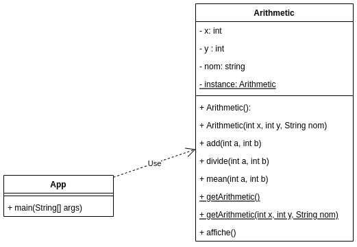
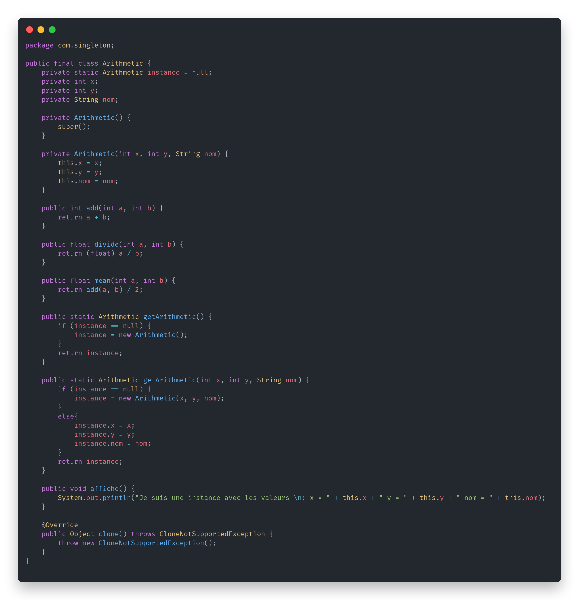

# TP INFO 4067

Nom : **Tomdieu TchadieuKo Ivan Gottfried**

Matricule : **20U2947**

## Exercice

### Singleton Pattern : Arithmetic Class

- **Diagram UML**

    

- **Code**

- App.java

    ```java
    import com.singleton.Arithmetic;

    public class App {
        public static void main(String[] args) throws Exception {

            
            int sum = Arithmetic.getArithmetic().add(5, 1);

            System.out.println("Sum is : "+sum);

            Arithmetic a1 = Arithmetic.getArithmetic(5,8,"ivantom");
            a1.affiche();

            

            Arithmetic b1 = Arithmetic.getArithmetic(-52, 25, "Tomdieu");
            b1.affiche();
        }
    }
    ```


