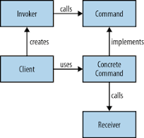

# Command Design Pattern

The Command pattern is a behavioral design pattern that allows encapsulating actions in objects. It is one of the most commonly used design patterns in the GoF book.

## When to use the Command pattern

- When you want to decouple an object that invokes an operation from the provider object that implements it.

- When you want to create a sequence of commands that can be executed, undone, or rolled back.

- When you want to implement a callback functionality in your program.

- When you want to structure your code with high-level operations that are built on top of primitive operations.

## How to implement the Command pattern

1. Identify the invoker and receiver objects.

2. Declare the command interface with a single execute method.

3. Implement the command interface with a concrete command class for each action.

4. Create a concrete receiver class and implement the action methods.

5. In the invoker class, add a field to store the reference to the command object, which should be initialized via the constructor.

6. In the invoker class, add a method to set and execute the command.

## Example

In the following example, we have a command interface that defines the execute method. The execute method is implemented by a concrete command class. The concrete command class is initialized with a receiver object. The receiver object implements the action methods. The invoker class stores the reference to the command object and executes the command.



```java

public interface Command {
    void execute();
}

public class ConcreteCommand implements Command {
    private final Receiver receiver;

    public ConcreteCommand(Receiver receiver) {
        this.receiver = receiver;
    }

    @Override
    public void execute() {
        receiver.action();
    }
}

public class Receiver {
    public void action() {
        System.out.println("Receiver: Executing an action");
    }
}

public class Invoker {
    private Command command;

    public void setCommand(Command command) {
        this.command = command;
    }

    public void executeCommand() {
        command.execute();
    }
}

```

The following code snippet shows how to use the Command pattern.

```java

Receiver receiver = new Receiver();

Command command = new ConcreteCommand(receiver);

Invoker invoker = new Invoker();

invoker.setCommand(command);

invoker.executeCommand();


// Output:

// Receiver: Executing an action

```

## Applicability

The Command pattern should be used when:

- You want to decouple an object that invokes an operation from the provider object that implements it.

- You want to create a sequence of commands that can be executed, undone, or rolled back.

- You want to implement a callback functionality in your program.

- You want to structure your code with high-level operations that are built on top of primitive operations.

## References

<https://en.wikipedia.org/wiki/Command_pattern>
